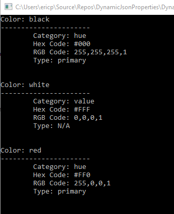

# Dynamic JSON Properties
This project is about dealing with dynamic json data using c#, spoiler alert it's 
the Dictionary object for the win.

If you're building and cosuming your own API using Visual Studio and the Web API then you 
probably won't need this information, If, however, you're consuming an API which was 
written in another language then you will probably run accross this issue.

When I’ve seen it, it looks like an attempt to save a few 
bytes of data. Here is an example of a normal bit of JSON data:

```json
{
  "colors": [
    {
      "color": "black",
      "category": "hue",
      "type": "primary",
      "code": {
        "rgba": [255,255,255,1],
        "hex": "#000"
      }
    },
    {
      "color": "white",
      "category": "value",
      "code": {
        "rgba": [ 0, 0, 0, 1 ],
        "hex": "#FFF"
      }
    },
    {
      "color": "red",
      "category": "hue",
      "type": "primary",
      "code": {
        "rgba": [255,0,0,1],
        "hex": "#FF0"
      }
    },
  ]
}
```

Every property has a name and a value. It would translate to c# classes 
that would look like this:

```csharp
public partial class Colors
{
    [JsonProperty("colors")]
    public Color[] ColorsRoot { get; set; }
}

public partial class Color
{
    [JsonProperty("color")]
    public string ColorColor { get; set; }

    [JsonProperty("category")]
    public string Category { get; set; }

    [JsonProperty("type", NullValueHandling = NullValueHandling.Ignore)]
    public string Type { get; set; }

    [JsonProperty("code")]
    public Code Code { get; set; }
}

public partial class Code
{
    [JsonProperty("rgba")]
    public long[] Rgba { get; set; }

    [JsonProperty("hex")]
    public string Hex { get; set; }
}
```

In truth, the `"color": "red",` wastes a few bytes because `"color:"` is actually unnecessary.
If every byte matters this can easily be re-written like this:

```JSON
{
  "colors": 
  {
    "black": {
      "category": "hue",
      "type": "primary",
      "code": {
        "rgba": [ 255, 255, 255, 1 ],
        "hex": "#000"
      }
    },

    "white": {
      "category": "value",
      "code": {
        "rgba": [ 0, 0, 0, 1 ],
        "hex": "#FFF"
      }
    },

    "red": {
      "category": "hue",
      "type": "primary",
      "code": {
        "rgba": [ 255, 0, 0, 1 ],
        "hex": "#FF0"
      }
    }
  }
}
```

This presents a problem however if you're used to the more normal 
JSON format. You no longer have a static class name for color, 
just the color itself. The field name for color is dynamic, 
it’s the name of the “color”. In other words, we won’t know the 
property name until runtime. This is a problem. I could hard 
code the color but it means I would be constantly changing my 
code to accommodate new colors.
Fortunately JSON.net has a way to deal with this using the 
Dictionary object in the form of `Dictionary<string, Class>`. 
The tricky part is figuring out how the classes line up, 
so here is the rule:

The property that contains the dynamic portion of JSON data 
becomes the `Dictionary<string, Class>`.
The body of that property becomes its own class.

So in the case above it looks something like this:

```csharp
public partial class Colors
{
    [JsonProperty("colors")]
    public Dictionary<string, Color> ColorsRoot { get; set; }
}

public partial class Color
{
    [JsonProperty("color")]
    public string ColorColor { get; set; }

    [JsonProperty("category")]
    public string Category { get; set; }

    [JsonProperty("type", NullValueHandling = NullValueHandling.Ignore)]
    public string Type { get; set; }

    [JsonProperty("code")]
    public Code Code { get; set; }
}

public partial class Code
{
    [JsonProperty("rgba")]
    public long[] Rgba { get; set; }

    [JsonProperty("hex")]
    public string Hex { get; set; }
}
```

Now let's put this into practice and see how it works.
With our classes created we can use the following code
to access the colors in the list. We just have to handle
it like any other dictionary object.

```csharp
//get some JSON data
string json = System.IO.File.ReadAllText("dynamic.json");

//deserialize the JSON and create a class
Colors colors = JsonConvert.DeserializeObject<Colors>(json);

//let's write the color list to screen
foreach (var color in colors.ColorsRoot.Keys)
{
    //write the color to the screen
    Console.WriteLine($"Color: {color}");
    Console.WriteLine("----------------------");

    //what about the child properties?
    //print the category
    Console.WriteLine($"\tCategory: {colors.ColorsRoot[color].Category}");

    //print the Hex code
    Console.WriteLine($"\tHex Code: {colors.ColorsRoot[color].Code.Hex}");

    //convert the rgba array to a csv string
    var stringResult = string.Join(",", colors.ColorsRoot[color].Code.Rgba);
    //print the RGB string
    Console.WriteLine($"\tRGB Code: {stringResult}");

    //print the color type
    Console.WriteLine($"\tType: {colors.ColorsRoot[color].Type}");

    //blank line
    Console.WriteLine(System.Environment.NewLine);
}

//leave the console paused
Console.Read();
```

and the result looks like this:



So you can see it's easy to deal with dynamic JSON properties
using JSON.Net and the Dictionary object.


